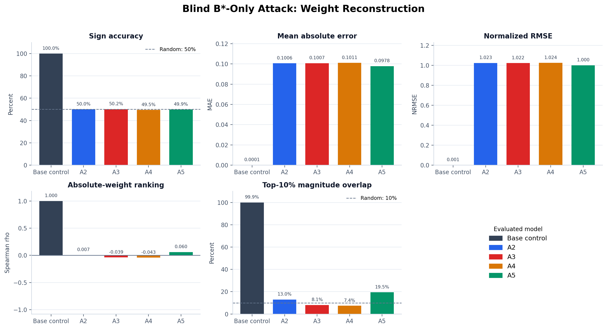
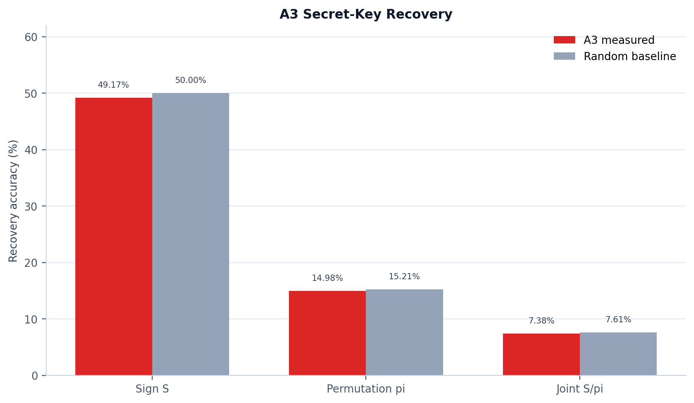
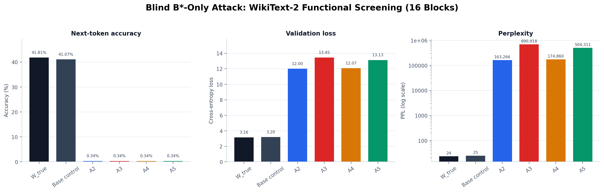
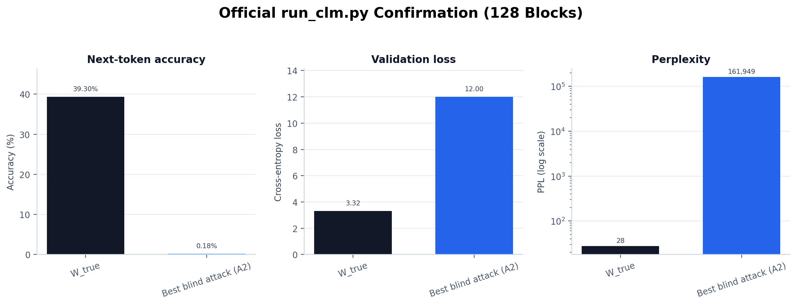

# Blind B*-Only Reconstruction Attack

## Threat Model

The attack generator is model-agnostic. It receives only:

- public randomized binary matrices `B*` and their tensor shapes;
- the published residual-binarization algorithm.

It does **not** receive or load GPT-2 identity/configuration, a pretrained
checkpoint, tokenizer, model-family weights, `W_true`, `W_BCQ`, `alpha`, `z`,
`S`, or `pi`. GPT-2 is known only to the evaluator, which places each completed
`W_attack` into the protected matrix locations and measures WikiText-2 utility.

## Why The Quantizer Does Not Reveal The Key

For one row, the protected representation is

```text
W_BCQ = z + sum_l alpha_l B_l
B*_k  = S_k B_pi(k)
```

Therefore reconstruction from `B*` requires coefficients
`beta_k = S_k alpha_pi(k)`. Knowing that residual binarization produced the
original `B_l` may provide a statistical clue about residual order, but it does
not reveal the independently sampled row-wise signs `S` or permutation `pi`.
There is no candidate residual to test because the attacker does not have `W`.

Absolute values are also not identifiable from `B*` alone. Positive rescaling
of a row preserves its binary bases while changing every `alpha`, and the
centering offset `z` is absent from the binary signs. Every blind method below
therefore needs an explicit, non-secret scale assumption.

## Attack Methods

- **A2 public order:** assign geometric residual weights in observed `B*`
  order and use a shape-only Xavier RMS.
- **A3 structural key search:** estimate residual order using transition rate
  and estimate signs using basis orientation. No reference/model weights are
  used.
- **A4 synthetic prior:** train a ridge coefficient estimator on generic
  Gaussian/heavy-tailed random matrices quantized and randomized locally.
- **A5 random base + B\*:** generate a seeded random matrix from public shape,
  then project it row-wise onto `span(1, B*)`.

The evaluator-only base control uses public GPT-2 to diagnose the unusually
small difference caused by the target checkpoint's 10-step fine-tuning. It is
not available to any blind attack method.

## Weight Results

All metrics compare each `W_attack` with secret evaluator-side `W_true`.

| Method | Sign accuracy | MAE | NRMSE | Spearman | Top-10% overlap |
|---|---:|---:|---:|---:|---:|
| A2 public order | 49.9939% | 0.100628 | 1.022717 | 0.006553 | 12.9724% |
| A3 structural key search | 50.1722% | 0.100713 | 1.022226 | -0.038801 | 8.0615% |
| A4 synthetic prior | 49.4577% | 0.101052 | 1.024223 | -0.042657 | 7.3842% |
| A5 random base + B* | 49.8717% | 0.097823 | 1.000182 | 0.059527 | 19.4580% |

A3 key recovery is near chance:

| Key metric | Result |
|---|---:|
| Sign recovery | 49.1694% |
| Permutation-position recovery | 14.9767% |
| Joint `S/pi` position recovery | 7.3775% |

The expected random permutation-position rate is between 12.5% (`Q=8`) and
16.7% (`Q=6`); the measured result is consistent with that range.

## Functional Results

Each candidate was injected into all 72 protected attention/MLP matrices. The
same 16 WikiText-2 validation blocks (16,368 next-token decisions) were used
for every row in this screening table.

| Model | Token accuracy | Validation loss | PPL | Accuracy retention | PPL ratio |
|---|---:|---:|---:|---:|---:|
| `W_true` | 41.8133% | 3.157944 | 23.522 | 100.00% | 1.0000 |
| Evaluator-only GPT-2 base control | 41.0679% | 3.199451 | 24.519 | 98.22% | 1.0424 |
| A2 public order | 0.3421% | 12.003136 | 163,266 | 0.82% | 6,940.94 |
| A3 structural key search | 0.3421% | 13.445776 | 690,918 | 0.82% | 29,373.03 |
| A4 synthetic prior | 0.3421% | 12.071739 | 174,860 | 0.82% | 7,433.82 |
| A5 random base + B* | 0.3421% | 13.130949 | 504,311 | 0.82% | 21,439.83 |

Official `run_clm.py` confirmation of the best screening candidate, A2, on 128
validation blocks (130,944 next-token decisions):

| Model | Token accuracy | Validation loss | PPL | Accuracy retention | PPL ratio |
|---|---:|---:|---:|---:|---:|
| `W_true` | 39.2992% | 3.318349 | 27.615 | 100.00% | 1.0000 |
| A2 public order | 0.1764% | 11.995038 | 161,949 | 0.45% | 5,864.60 |

Checkpoint validation found an exact match to the saved A2 matrices (maximum
absolute difference `0.0`). Exactly the expected 48 Hugging Face weight
parameters changed: 12 combined QKV weights plus 36 attention/MLP projection
weights. Embeddings, LayerNorm, biases, and LM head stayed at `W_true`.

## Figures









The corresponding vector PDFs and source CSV are in `figures/`.

## Decision

Under the blind B*-only threat model, none of the tested attacks reconstructs
useful weight signs, values, rankings, or language-model functionality. A3 does
not recover `S/pi` merely from knowing residual binarization, and A5 no longer
inherits GPT-2 utility after its pretrained-base input is removed.

This result supports resistance to these four tested blind attacks; it is not a
proof against all possible attacks.

## Reproduction

```bash
python BCQ/run_blind_bstar_attacks.py \
  --public-b-star BCQ/attacks/cpu-smoke-test-002-mixed-q6-q8-activation-aware/blind-bstar-only/public/public_b_star.safetensors \
  --output-dir BCQ/attacks/cpu-smoke-test-002-mixed-q6-q8-activation-aware/blind-bstar-only/candidates

python BCQ/evaluate_public_b_attacks.py \
  --model-path outputs/cpu-smoke-test-002 \
  --reference-w-true BCQ/artifacts/cpu-smoke-test-002-mixed-q6-q8-activation-aware/reference_w_true.safetensors \
  --attack-dir BCQ/attacks/cpu-smoke-test-002-mixed-q6-q8-activation-aware/blind-bstar-only/candidates \
  --secret-key BCQ/attacks/cpu-smoke-test-002-mixed-q6-q8-activation-aware/blind-bstar-only/secret/secret_s_pi.safetensors \
  --base-model openai-community/gpt2 \
  --output-dir BCQ/attacks/cpu-smoke-test-002-mixed-q6-q8-activation-aware/blind-bstar-only/evaluation \
  --eval-samples 16 --full-best-samples 128

conda run -n base python BCQ/plot_blind_attack_results.py
```

Artifacts:

- attacker candidates and manifest: `candidates/`
- attacker input package: `public/`
- evaluator-only randomization key and validation: `secret/`
- machine-readable evaluation: `evaluation/attack_results.json`
- official A2 metrics: `evaluation/a2-full/eval_results.json`
- injection validation: `evaluation/checkpoint_validation.json`
- PNG/PDF charts and functional source data: `figures/`
- Transformers commit: `7c65cdb570646e8b01cc30d069579f2f4b60c398`
