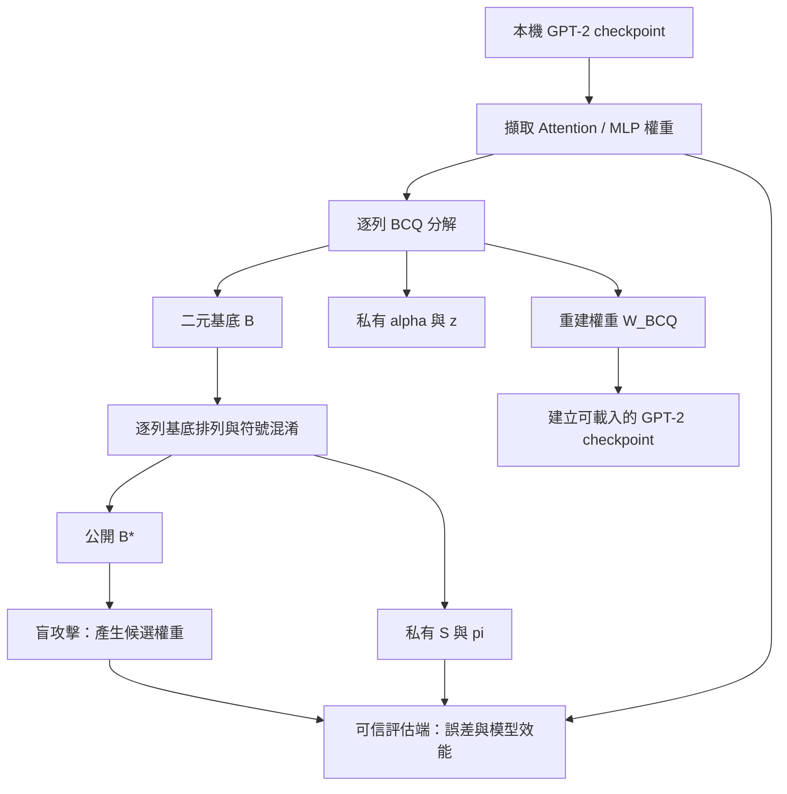

# GPT-2 BCQ：架構與操作指南

本專案在 Transformers 的 GPT-2 上實作逐列 Binary Coding Quantization（BCQ），將浮點權重分解成二元基底、縮放係數與偏移量，並提供 B* 混淆和權重重建攻擊實驗。

以下指令均在本 repository 根目錄執行。完整範例使用 **Q=6、alternating**，因為現有盲攻擊腳本只接受 Q=6 或 Q=8。若只做量化，可改用 Q=3 或 Q=4，但不能直接接續此處的盲攻擊流程。

## 1. BCQ 架構

### 1.1 量化哪些權重？

`BCQ/extract_gpt2_weights.py` 從每個 GPT-2 Transformer block 擷取六個矩陣：

| 矩陣 | 用途 |
| --- | --- |
| `W_Q`、`W_K`、`W_V` | Attention 的 Query、Key、Value 投影 |
| `W_O` | Attention 輸出投影 |
| `W_FC` | MLP 輸入投影 |
| `W_PROJ` | MLP 輸出投影 |

GPT-2 原本的 Conv1D 權重以 `[in_features, out_features]` 儲存；擷取後統一轉成 `[out_features, in_features]`，並將合併的 QKV 拆開。若模型有 12 層，共得到 72 個矩陣。

目前不量化 bias、LayerNorm、token embedding、position embedding 與 LM head。

### 1.2 逐列分解

對每個矩陣的第 i 列，重建公式為：

```text
W_BCQ[i, j] = z[i] + Σ(k=0 … Q-1) alpha[i, k] × B[k, i, j]
```

| 符號 | 形狀 | 意義 |
| --- | --- | --- |
| `W`、`W_BCQ` | `[rows, columns]` | 原始與重建權重 |
| `B` | `[Q, rows, columns]` | 值為 -1 或 +1 的二元基底 |
| `alpha` | `[rows, Q]` | 每列、每個基底的縮放係數 |
| `z` | `[rows, 1]` | 每列偏移量 |

`--q` 指定基底數。增加 Q 會增加儲存量與計算成本，量化品質應以實際誤差與語言模型評估確認。此實作將 B 儲存為 `int8`，沒有 bit packing，因此不能直接把 Q 解讀為實際檔案每個權重只占 Q bits。

支援兩種方法：

- `greedy`：先扣除每列平均值，再依序使用殘差符號產生 B，並以殘差絕對值平均估計 alpha。
- `alternating`：以 greedy 初始化，交替更新二元基底，以及透過逐列最小平方求解 alpha、z；可用 `--alternating-iterations` 設定最多迭代次數。

### 1.3 資料流程



`build_bcq_gpt2_checkpoint.py` 將已重建的浮點 W_BCQ 寫回 GPT-2。輸出仍是一般浮點模型，不是直接以二元運算加速推論的 BCQ kernel。

## 2. 環境準備

若已有可用的 `.venv`，直接啟用；新環境可執行：

```bash
python3 -m venv .venv
source .venv/bin/activate
python -m pip install --upgrade pip
python -m pip install -e .
python -m pip install torch safetensors datasets scipy numpy matplotlib
python -m pip install -r examples/pytorch/language-modeling/requirements.txt
```

確認使用本地程式碼：

```bash
python -c 'import torch, transformers; print(torch.__version__); print(transformers.__file__)'
```

下列 BCQ 腳本主要在 CPU 執行，沒有 `--device cuda` 參數。完整 GPT-2、多個基底與攻擊候選需要數 GB 磁碟空間及足夠 RAM。

## 3. 準備本機 GPT-2 模型

BCQ 擷取程式使用 `local_files_only=True`，`--model-path` 必須是本機模型資料夾。資料夾應含模型設定、權重及 tokenizer，以便後續建立 checkpoint。

若已有微調模型，例如 `outputs/cpu-smoke-test-002`，可直接使用。若要先以原始 GPT-2 跑通流程，可下載模型：

```bash
python - <<'PY'
from transformers import AutoModelForCausalLM, AutoTokenizer

source = "openai-community/gpt2"
destination = "outputs/gpt2-source"
model = AutoModelForCausalLM.from_pretrained(source)
tokenizer = AutoTokenizer.from_pretrained(source)
model.save_pretrained(destination, safe_serialization=True)
tokenizer.save_pretrained(destination)
PY
```

接著在同一個終端機設定路徑；使用微調模型時，修改 `MODEL_PATH` 即可：

```bash
export MODEL_PATH="outputs/gpt2-source"
export BCQ_DIR="BCQ/artifacts/gpt2-q6-alternating"
export BCQ_MODEL="outputs/gpt2-bcq-q6"
export ATTACK_ROOT="BCQ/attacks/gpt2-q6-blind"
```

以上下載步驟需要網路；後續資料集評估第一次執行也可能下載 WikiText。使用原始 GPT-2 只適合驗證流程；若評估程式的 base model 也使用相同 GPT-2，該對照不是獨立的微調權重重建實驗。

## 4. 執行 BCQ 量化

```bash
python BCQ/extract_gpt2_weights.py \
  --model-path "$MODEL_PATH" \
  --output-dir "$BCQ_DIR" \
  --q 6 \
  --method alternating \
  --alternating-iterations 20
```

執行時會逐矩陣列印形狀與相對誤差。完成後產生：

| 檔案 | 內容與用途 |
| --- | --- |
| `reference_w_true.safetensors` | 原始權重，供可信評估端比較 |
| `public_b_q6.safetensors` | 未混淆二元基底 B |
| `secret_alpha_z_q6.safetensors` | 重建所需的 alpha 與 z |
| `baseline_w_bcq_q6.safetensors` | BCQ 重建浮點權重 |
| `manifest.json` | 方法、Q、逐矩陣與整體誤差、檔案雜湊及執行資訊 |
| `extract_gpt2_weights.snapshot.py` | 本次使用的擷取程式快照 |

若改用其他 Q，檔名中的 `q6` 也會跟著改變。輸出目錄非空時，腳本預設拒絕執行；重新實驗請選新目錄，確定要覆寫時才加 `--overwrite`。

## 5. 檢查量化品質

```bash
python BCQ/evaluate_quantization_baseline.py \
  --artifact-dir "$BCQ_DIR" \
  --q-values 3 4 6
```

報告預設寫入 `$BCQ_DIR/quantization_baseline/`。此步驟比較不同 Q 的權重重建品質，並核對已儲存的 baseline；不是攻擊實驗，也不是語言模型 perplexity 測試。

閱讀 MSE、RMSE 與 relative Frobenius error 時，數值越低代表權重重建越接近原始矩陣；仍需下一步檢查模型功能。

## 6. 建立並評估 BCQ GPT-2 checkpoint

```bash
python BCQ/build_bcq_gpt2_checkpoint.py \
  --model-path "$MODEL_PATH" \
  --artifact-dir "$BCQ_DIR" \
  --output-dir "$BCQ_MODEL"
```

程式會保留未量化的參數、回填六類矩陣，並檢查回填結果是否與 W_BCQ 一致。

使用 repository 的 causal language modeling 範例評估：

```bash
python examples/pytorch/language-modeling/run_clm.py \
  --model_name_or_path "$BCQ_MODEL" \
  --dataset_name wikitext \
  --dataset_config_name wikitext-2-raw-v1 \
  --do_eval \
  --block_size 128 \
  --max_eval_samples 128 \
  --per_device_eval_batch_size 1 \
  --output_dir outputs/gpt2-bcq-q6-eval \
  --report_to none
```

用相同資料與參數再評估原始 `$MODEL_PATH`，並換一個 `--output_dir`，才能比較量化前後的 loss 與 perplexity。這裡只取 128 個評估樣本作初步檢查，不代表完整測試集結果。

## 7. 選用：B* 混淆與機密性實驗

### 7.1 建立 B*

每個矩陣、每一列分別產生基底排列 pi 與符號 S：

```text
B_star[k, i, :] = S[i, k] × B[pi[i, k], i, :]
```

```bash
python BCQ/prepare_public_b_star.py \
  --public-b "$BCQ_DIR/public_b_q6.safetensors" \
  --output-dir "$ATTACK_ROOT" \
  --seed 20260903
```

輸出包括：

- `public/public_b_star.safetensors`：盲攻擊輸入。
- `secret/secret_s_pi.safetensors`：真實符號與排列，供可信端保留。
- `threat_model.json`：轉換、seed、檔案資訊與實驗邊界。

這是可重現的研究實驗，不是已證明安全的加密方案。程式採用固定 seed 的 PyTorch 亂數產生器，且會記錄 seed；知道 seed 與產生流程的人可以重現排列與符號。進行「只看 B*」的攻擊實驗時，只交付指定的 public 檔案，不交付 alpha、z、S、pi、原始權重、重建權重或含 seed 的實驗紀錄。這項輸入隔離也不等同於正式的安全保證。

### 7.2 只從 B* 產生攻擊候選

```bash
python BCQ/run_blind_bstar_attacks.py \
  --public-b-star "$ATTACK_ROOT/public/public_b_star.safetensors" \
  --output-dir "$ATTACK_ROOT/candidates"
```

目前腳本只支援 Q=6 或 Q=8，包含四類方法：

| 方法 | 做法 |
| --- | --- |
| `a2_public_order` | 依觀察到的基底順序配置幾何衰減係數 |
| `a3_structural_key_search` | 由基底轉換率與方向推測排列及符號 |
| `a4_synthetic_prior` | 用合成隨機矩陣學習係數先驗 |
| `a5_random_base_projection` | 將由形狀產生的隨機矩陣投影至基底空間 |

候選權重與 `attack_manifest.json` 寫入 `candidates/`。此階段不需要提供真實權重或密鑰。

### 7.3 在可信端評估攻擊

評估程式需要原始模型、真實矩陣及真實密鑰，這些只供量測使用。其 base model 使用 `local_files_only=True`；若尚未快取，先下載一次：

```bash
python - <<'PY'
from transformers import AutoModelForCausalLM
AutoModelForCausalLM.from_pretrained("openai-community/gpt2")
PY

python BCQ/evaluate_public_b_attacks.py \
  --model-path "$MODEL_PATH" \
  --reference-w-true "$BCQ_DIR/reference_w_true.safetensors" \
  --attack-dir "$ATTACK_ROOT/candidates" \
  --secret-key "$ATTACK_ROOT/secret/secret_s_pi.safetensors" \
  --base-model openai-community/gpt2 \
  --output-dir "$ATTACK_ROOT/evaluation" \
  --eval-samples 16 \
  --full-best-samples 128
```

主要結果寫入 `evaluation/attack_results.json`，包含權重重建、密鑰恢復與模型功能評估。程式也包含 base-model 與 oracle 對照；oracle 使用額外真實資訊，不應算成只取得 B* 的攻擊能力。

## 8. 執行順序與常見問題

基本量化流程：**準備模型 → 擷取與 BCQ 分解 → 檢查量化誤差 → 建立 checkpoint → 比較模型效能**。

機密性實驗再接續：**建立 B* → 產生盲攻擊候選 → 可信端評估**。

- **找不到模型或 tokenizer**：確認 `MODEL_PATH` 指向完整的本機 `save_pretrained` 目錄，而非單一權重檔。
- **輸出目錄已存在**：使用新的實驗目錄；需要保留舊結果時不要加 `--overwrite`。
- **`Unsupported public basis count`**：盲攻擊目前只支援 Q=6、Q=8，請確認來源量化設定。
- **執行時間長或 RAM 不足**：alternating 與多候選攻擊成本較高。可先用 greedy 跑通量化，但不同方法需分開命名與比較。
- **Git 加入檔案很慢**：模型與實驗產物可能達數 GB；上傳程式碼時應用 `.gitignore` 排除虛擬環境與不打算分享的模型產物。忽略規則不會移除已提交的檔案歷史。

若有疑問，可用 `python BCQ/<腳本名稱>.py --help` 查閱該腳本實際接受的參數。既有資料夾中的 mixed-Q 或 activation-aware 實驗名稱，不代表 `extract_gpt2_weights.py` 有這些命令列模式；目前入口提供的是單一 Q 的 greedy / alternating。
